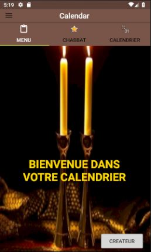
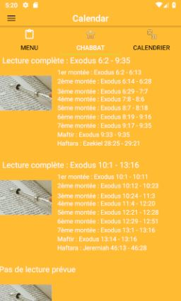
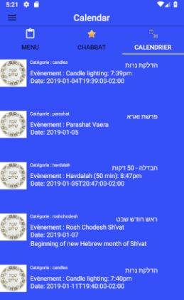

# Projet_Mobile_4A: APPLICATION CALENDAR

## Développeur (4A)

- Daniel Elgrably

&nbsp;

## Présentation

Ce projet a pour principaux buts l'utilisation d'appel WebService à une API REST ainsi que des listes de view dans une application android, scindée en Fragments, codée en Java.

Cette application affiche le calendrier des chabbats et fêtes juives en utilisant l'API suivante disponible sur Github : "https://www.hebcal.com/home/195/jewish-calendar-rest-api". Par ailleurs, toujours avec cette API, nous pouvons afficher les montées du chabat. En effet, chaque chabbat, nous lisons une section des livres du pentateuque, de façons à les finir en un ans. Cette section est subdivisée en 7 montées (sous section). Enfin, le "maftir" reprend les derniers versets de la septième montée. Puis la haftarah est constituée d'un passage tiré des livres des prophètes. 

&nbsp;

## Prérequis

- Installation d'Android Studio 
Ce projet est le deuxième que je réalise sous Android Studio. 
- J'ai donc récupéré le précédent projet, disponible dans le répertoire "https://github.com/danielgrably/Calendar". 
Je l'ai retravaillé pour lui accorder de nouvelles fonctionnalitées.
- Il n'y avait pas d'autres prérequis.

&nbsp;

## Consignes respectées : 

- Trois Fragments
- RecyclerView, DrawerLayout, LinearLayout, AppBar, ToolBar 
- Appels WebService à une API Rest
- Architecture MVC
- Material Design
- Sauvegarde en cache
- Autres fonctionnalités 
  - Changement logo de l'application + logos sur les Tab 
  - Supression élèment par swip
  - Toast message
  - Changement de fond et animation lors des déplacements entre les Fragments
  - Déplacement en swippant

&nbsp;

## Architecture du projet:

### Model
* Calendar : -------------->*Objet contenant les informations récupérées de l'API*
* Leyning : --------------->*Objet dans calendar contenant les montées et lectures*
* RestCalendarResponse

### View
* MainActivity : ----------->*Pour l'écran d'accueil, fonction pour les déplacements entre fragments et définitions des divers éléments Toolbar, TabLayout, TabItem, DrawerLayout, ViewPager*
* MenuFragment : -------->*Affichage du Fragment menu avec le Toast* 
* ChabbatFragment : ---------->*Affichage du Fragment Chabbat contenant la liste des montées et lectures*
* CalendrierFragment : ---------->*Affichage du Fragment Calendrier contenant la liste des évènements à venir*

### Controler
* Cont : -------------------->*Constructeur pour le CalendrierFragment*
* Cont_bis : ---------------->*Constructeur pour le ChabbatFragment*
* MyAdapter : ------------->*Adapteur pour le CalendrierFragment*
* MyAdapter_bis:----------->*Adapteur pour le ChabbatFragment*
* RestCalendarAPI

&nbsp;

## Fonctionnalités: 

### Premier écran 

L'écran qui s'affiche au démarrage est l'écran d'accueil. Au commencement du chabbat ou des fêtes, nous avons l'habitude d'allumer deux bougies, c'est ce qui est représenté par le fond d'écran. 
Outre le titre, trois items dominant la page sont proposés à l'utilsateur.
- Le premier, "Menu" c'est le fragment sur lequel il se trouve lors de l'ouverture de l'application. 
- Le second, "Chabbat" ouvre le deuxième fragment affichant la répartition des montées pour la lecture de chabat.
- Le troisième, "Calendrier" ouvre le troisième fragment affichant les prochains évènements.

### Second Fragment

- Affiche la liste des montées des lectures hebdomadaires.

   

### Troisième Fragment

- Affiche la liste des prochains évènements avec leur catégorie, leur noms en anglais et en hébreu, ainsi que leur date.

  

